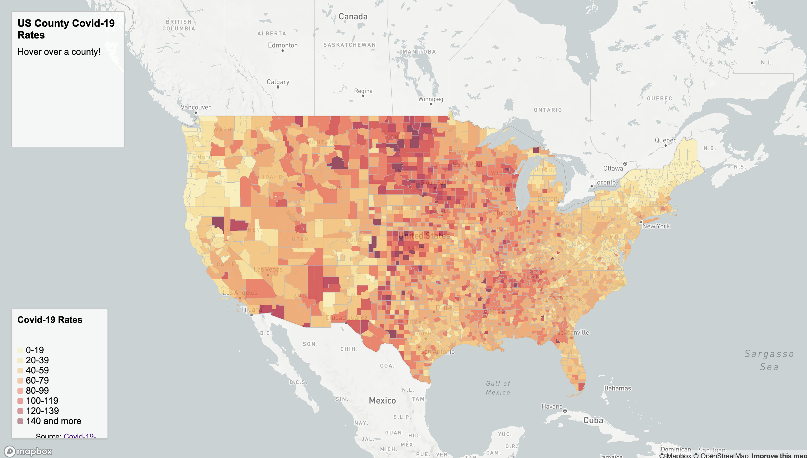
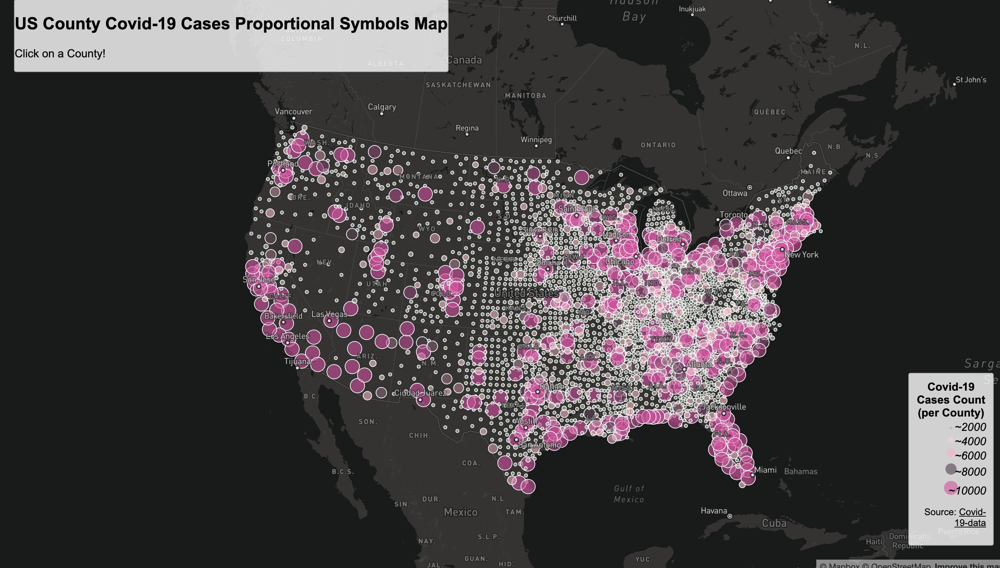

# Covid-19 Thematic Maps

<h3>Project Introduction</h3>

The project will includes two map: one is a choropleth map of the covid-19 rates and the other is a proportional symbols map of covid-19 cases. 

<h3>Data Source</h3>
The COVID-19 case/death data you will be using are originally from <a href="https://github.com/nytimes/covid-19-data/blob/43d32dde2f87bd4dafbb7d23f5d9e878124018b8/live/us-counties.csv">The New York Times</a>. The data include all the cases in 2020. The population data used for calculating the case rates are from the<a href="https://data.census.gov/cedsci/table g=0100000US%24050000d=ACS%205-Year%20Estimates%20Data%20Profiles&tid=ACSDP5Y2018.DP05&hidePreview=true"> 2018 ACS 5 year estimate</a>. Both data are at the county level. The U.S. county boundary shapefile was downloaded from<a href="https://www.census.gov/geographies/mapping-files/time-series/geo/carto-boundary-file.html"> the U.S. Census Bureau</a>

<h3>Links To Map</h3>
<ul>
<li><a href="">Map 1</a></li>
<li><a href="">Map 2</a></li>
</ul>

<h3>Screenshots</h3>

<h5>Covid-19 Choropleth Map</h5>

<h5>Covid-19 Proportional Map</h5>

<h5>Credits</h5>
<h3>Links To Map</h3>
<ul>
<li><a href="https://docs.mapbox.com/mapbox.js/api/">MapBox Library</a></li>
<li><a href="https://github.com/jakobzhao/geog495/tree/main/labs/lab04">Professor Zhao's Github Tutorial</a></li>
</ul>
